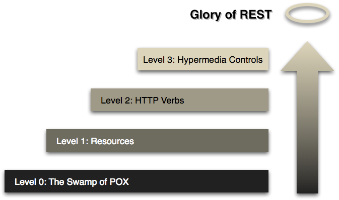
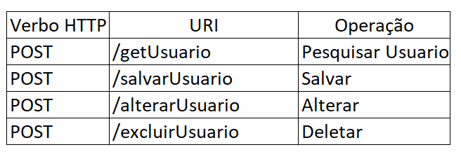
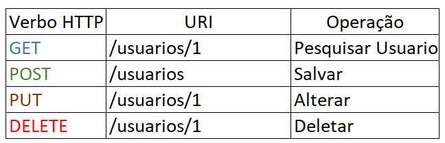
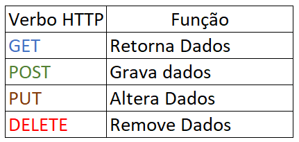
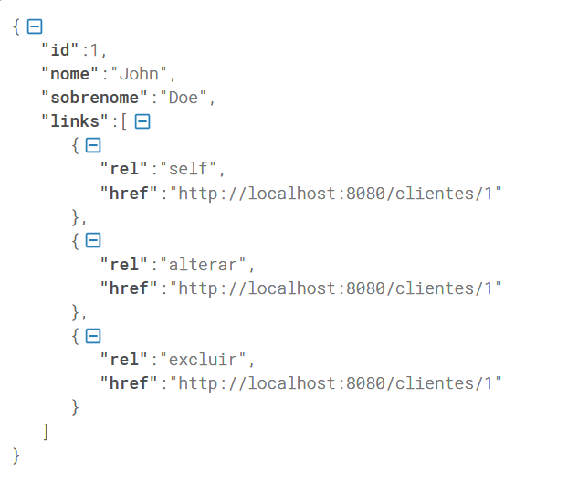
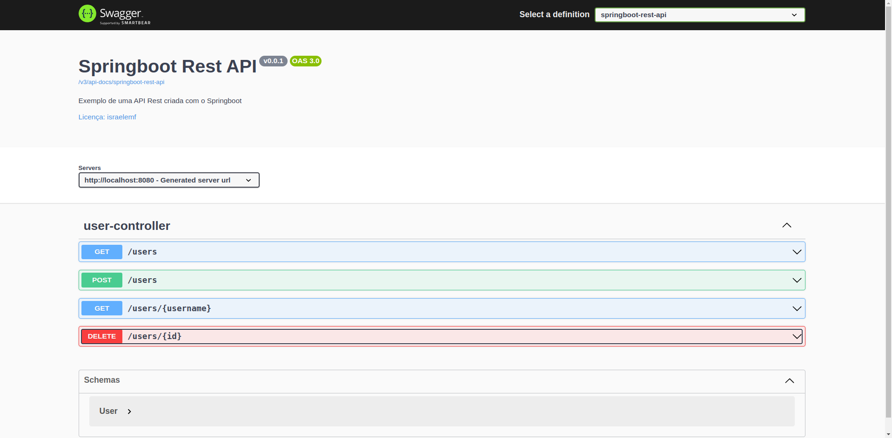

# Spring Web

Quando falamos de Spring Web, temos dois direcionamentos, o famoso MVC, que é o ecossistema de Model, View e Controller
que é a concepção das nossas páginas, ou só uma concepção de REST API.

Nesse projeto teremos um exemplo de uma API REST desenvolvida com Spring Web e documentada com Swagger.

### MVC
- Voltado a uma aplicação Web com interfaces gráficas, páginas.
### API REST
- Camada de disponibilização de recursos, ou API's diante da arquitetura REST.

## API
- Uma API (Interface Application Program) é um programa que faz a "ponte" de comunicação entre duas
aplicações distintas.

## REST e RESTful
Uma API **REST** (Representational State Transfer) é como um guia de boas práticas, e o **RESTful**
é a capacidade de determinado sistema aplicar os principios **REST**.

Nem todas as API's ou Webservices existentes estão aderentes aos conceitos **REST**.

### Princípios REST
Para uma arquitetura de sistema ser considerada RESTful, é necessário seguir uma série de padrões.

- **cliente-servidor**
  - Significa aprimorar a portabilidade entre várias plataformas de interface do usuário e do servidor, permitindo
uma evolução independente do sistema. Precisamos de uma interação mais simples entre a camada da API com o sistema 
que solicita.
- **interface uniforme**
  - Representa uma única forma de interação entre cliente e servidor. Para isso, é preciso ter uma interface que 
identifique e represente recursos, mensagens autodescritivas, bem como hypermedia (HATEOAS).
- **stateless**
  - Indica que cada interação via API tenha acesso a dados completos e compreensíveis. Cada requisição deve ter uma perspectiva
de retornar todos os dados para aquele contexto.
- **cache**
  - Necessário para reduzir o tempo médio de resposta, melhorar a eficiência, desempenho e escalabilidade da comunicação.
  - Em alguns momentos nossa API terá a capacidade de deixar pré-fornecido alguns recursos, para que não seja necessário
um processamento a cada requisição.
- **camadas**
  - Permite que a arquitetura seja menos complexa e altamente flexível.

### Nível de Maturidade
Existe um modelo de maturidade para esse tipo de API, proposto por Leonard Richardson, que é definido em 4 níveis.



- Nivel 0: Ausência de Regras
  
  - Considerado o nível mais básico, uma API que só segue esse padrão não é considerada REST.
  - Um único verbo com nomes que não seguem nenhum padrão.

- Nível 1: Aplicação de Resources
  
  - Nesse nível, o nome dos recursos foram equalizados, e para não gerar ambiguidade é necessário definir o verbo apropriado.

- Nível 2: Implementação de verbos HTTP
  
  - Como a definição dos verbos já são realizadas no Nível 1, o Nível 2 se encarrega de validar a aplicabilidade dos verbos
para finalizadades específicas.

- Nível 3: HATEOAS
  - Raramente implementada em API's, fornece em cada requisição, links que indicarão como poderá ser feita a navegação
entre seus recursos. Ou seja, quem for consumir a API precisará saber apenas a rota principal e a resposta dessa requisição
fornecerá todas as demais rotas possíveis.
  
  
  
  - Acima, um resultado de uma API que implementa HATEOAS, em cada resposta existe uma collection de links.

## Controller
Um Controller é um recurso que disponibiliza funcionalidades de negócio da aplicação através do protocolo HTTP,
conforme exemplo visto abaixo:

```
import org.springframework.web.bind.annotation.RestController;
import org.springframework.web.bind.annotation.GetMapping;

@RestController
public class WelcomeController {
    @GetMapping("/welcome")
    public String welcome(){
        return "Welcome to a Spring Boot REST API";
    }
}
```

### Rest Controller
Um Rest Controller em Spring nada mais é que uma classe contendo anotações específicas para disponibilizar
recursos HTTP com base em nossos serviços e regras de negócio.

Anotações e configurações mais comuns:

- @RestController
  - Responsável por designar o bean de compoment, que suporta requisições HTTP com base na arquitetura REST.
- @RequestMapping("prefix")
  - Determina qual a URI comum para todos os recursos disponibilizados pelo Controller.
- @GetMapping
  - Determina que o método aceitará requisições HTTP do tipo GET.
- @PostMapping
  - Determina que o método aceitará requisições HTTP do tipo POST.
- @PutMapping 
  - Determina que o método aceitará requisições HTTP do tipo PUT.
- @DeleteMapping
  - Determina que o método aceitará requisições HTTP do tipo DELETE.
- @RequestBody
  - Converte um JSON para o tipo do objeto esperado como parâmetro no método.
- @PathVariable 
  - Consegue determinar que parte da URI será composta por parâmetros recebidos nas requisições.

## Documentação de API com Swagger
O Swagger é uma linguagem de descrição de interface para descrever APIs RESTful expressas utilizando JSON.

É utilizado em conjunto com outras ferramentas de software de código aberto para projetar, construir, documentar e 
usar serviços da Web RESTful

Um exemplo da documentação do controller do projeto em questão utilizando Swagger:




## Exception Handlers

O tratamento de exceção é o mecanismo responsável pelo tratamento da ocorrência de condições que alterar o fluxo normal
da execução de um programa, com o retorno em forma de uma mensagem, informando qual foi a ocorrência e sua resolução.

Existem alguns tipos de tratamentos de exceções em uma aplicação Spring Web.

### Solução 1: Nível do Controller 
Funciona no nível do @Controller, onde cada método trata uma exceção de forma declarativa com **@ExceptionHandler**

```
public class MeuController{
    
    //...
    @ExceptionHandler({ MinhaException1.class})
    public void meuMetodo() {
        //
    }
}
```

Não é uma abordagem tão produtiva quando se trata de grandes projetos.

### Solução 2: ResponseStatusExceptionResolver
Conseguimos estipular exceções com base em mapeamentos de códigos de status HTTP, redirecionando para a exceção

```
@ResponseStatus(value = HttpStatus.NOT_FOUND)
public class RecursoNotFoundException extends RuntimeException {
    public RecursoNotFoundException() {
        super();
    }
    public RecursoNotFoundException(String message) {
        super(message);
    }
}
```

### RestController Advice

O Spring 3.2 traz suporte para um **@ExceptionHandler** global com a anotação **@ControllerAdvice**

Essa anotação @ControllerAdvice nos permite realizar múltiplos @ExceptionHandler, antes espalhados, em um único
componente global de tratamento de erros.

- Controle total sobre o corpo da resposta, bem como o código de status
- Ele fornece o mapeamento de várias exceções ao mesmo método, para serem tratadas em conjunto
- Ele faz bom uso da respota RESTful

### Configurando um GlobalExceptionHandler

Para isso, precisamos configurar um tratamento de exceções global, para que intercepte todas as exceções que podem
ocorrer na aplicação, semp recisar tornar declarativo em todos os recursos.

#### Customizando nossas mensagens
Em uma resposta HTTP, mesmo sendo um erro, pode ser considerada um objeto que será convertido em JSON, expondo
informações relacionadas a exceção disparada.

```
import java.util.Date;

public class ResponseError {
	private Date timestamp = new Date();
	private String status = "error";
	private int statusCode = 400;
	private String error;
	
	//getters e setters
}
```

#### Definindo uma exceção de negócio

Algumas das exceções podem estar relacionadas ao domínio ou negócio da aplicação, e deve existir uma classes de exceção
que estende RunTimeException, que vai servir como base para todas as nossas outras exceções de negócio.

```
public class BusinessException extends RuntimeException {
	public BusinessException(String mensagem) {
		super(mensagem);
	}
	public BusinessException(String mensagem, Object ... params) {
		super(String.format(mensagem, params));
	}
}
```

#### Configurando o Exception Handler

Vamos criar a classe que vai buscar todas as exceções de negócio BusinessException para tratar, converter e retornar
mensagens mais declarativas ao usuário da aplicação

Ai que entra o **GlobalExceptionHandler**, onde vai ficar agrupado todas as exceções que podem ocorrer na aplicação.


